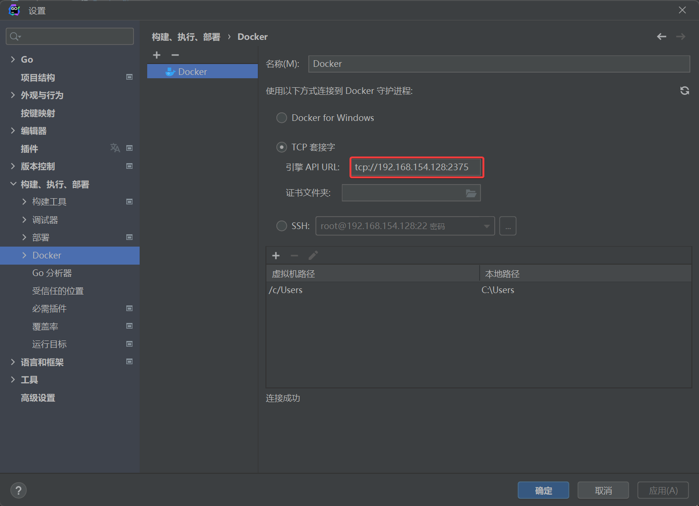

# Jetbrains docker远程连接使用

## 目录

-   [1.保证可以正常使用docker](#1保证可以正常使用docker)
-   [2. 编辑docker配置文件](#2-编辑docker配置文件)
-   [3. 执行一下指令重启docker服务](#3-执行一下指令重启docker服务)
-   [4. 配置IDE中docker](#4-配置IDE中docker)

## 1.保证可以正常使用docker

## 2. 编辑docker配置文件

```bash
sudo vim  /lib/systemd/system/docker.service
# 替换为如下
[Service]
Type=notify
# the default is not to use systemd for cgroups because the delegate issues still
# exists and systemd currently does not support the cgroup feature set required
# for containers run by docker
# ExecStart=/usr/bin/dockerd -H fd:// --containerd=/run/containerd/containerd.sock
ExecStart=/usr/bin/dockerd  -H tcp://0.0.0.0:2375  -H unix:///var/run/docker.sock
ExecReload=/bin/kill -s HUP $MAINPID
TimeoutSec=0
RestartSec=2
Restart=always

```

## 3. 执行一下指令重启docker服务

```bash
systemctl daemon-reload             #重新加载配置文件
systemctl restart docker.service    #重启服务 
netstat -tunlp                      #查看2375端口是否开启
curl http://127.0.0.1:2375/info     #测试远程链接端口是否开启成功
```

## 4. 配置IDE中docker


