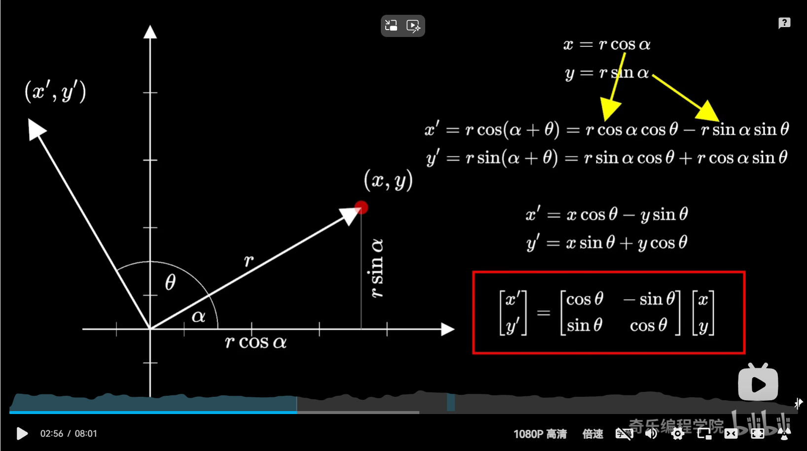

# FOC电机控制

**FOC（Field-Oriented Control）**，直译是磁场定向控制，也被称作矢量控制**（VC，Vector Control）**，是目前无刷直流电机（BLDC）和永磁同步电机（PMSM）高效控制的最优方法之一。FOC旨在通过精确地控制磁场大小与方向，使得电机的运动转矩平稳、噪声小、效率高，并且具有高速的动态响应。

### 驱动电路的实现

## 理论基础

### FOC控制的流程

1. 对电机三相电流进行采样得到 $I_{a},I_{b},I_{c}$
2. 将 𝐼𝑎,𝐼𝑏,𝐼𝑐 经过`Clark变换`得到 𝐼𝛼,𝐼𝛽
3. 将 𝐼𝛼,𝐼𝛽 经过`Park变换`得到 𝐼𝑞,𝐼𝑑
4. 计算 𝐼𝑞,𝐼𝑑 和其设定值 𝐼𝑞_𝑟𝑒𝑓,𝐼𝑑_𝑟𝑒𝑓 的误差
5. 将上述误差输入两个PID（只用到PI）控制器，得到输出的控制电压 𝑈𝑞,𝑈𝑑
6. 将 𝑈𝑞,𝑈𝑑 进行`反Park变换`得到 𝑈𝛼,𝑈𝛽
7. 用 𝑈𝛼,𝑈𝛽 合成电压空间矢量，输入`SVPWM模块`进行调制，输出该时刻三个半桥的状态编码值（前文有提到）
8. 按照前面输出的编码值控制三相逆变器的MOS管开关，驱动电机
9. 循环上述步骤

### 克拉克变换(Clark变换)

$$
\begin{bmatrix} 

 I_{\alpha }  \\

 1_{\beta }

\end{bmatrix} = \begin{bmatrix}

 1 & -\frac{1}{2} & -\frac{1}{2}\\

 0 & \frac{\sqrt{3}}{2}  & -\frac{\sqrt{3}}{2}

\end{bmatrix} 

\begin{bmatrix}

 I_{a}\\

 I_{b} \\

 I_{c}

\end{bmatrix}
$$

## 名词解析

### 力矩

力矩（扭力）是个**旋转力**。

### 低通滤波器

顾名思义，低通滤波器具备**通低频阻高频**的功能，并且低通滤波器的特性使得**低于设定临界值频率的信号能正常通过**，而**高于设定临界值频率（fc）的信号则被阻隔和衰减**。低通滤波可以简单的认为：设定一个频率点，当信号频率高于这个频率时不能通过。

### 旋转矩阵

## 参考链接

[【自制FOC驱动器】深入浅出讲解FOC算法与SVPWM技术 - 知乎 (zhihu.com)](https://zhuanlan.zhihu.com/p/147659820)

[从理论到硬件：SVPWM和FOC上手教程 - 知乎 (zhihu.com)](https://zhuanlan.zhihu.com/p/653313547)

[彻底搞懂“旋转矩阵/欧拉角/四元数”，让你体会三维旋转之美_欧拉角判断动作-CSDN博客](https://blog.csdn.net/weixin_45590473/article/details/122884112)

[低通滤波器的探究-CSDN博客](https://blog.csdn.net/sy243772901/article/details/119608204)