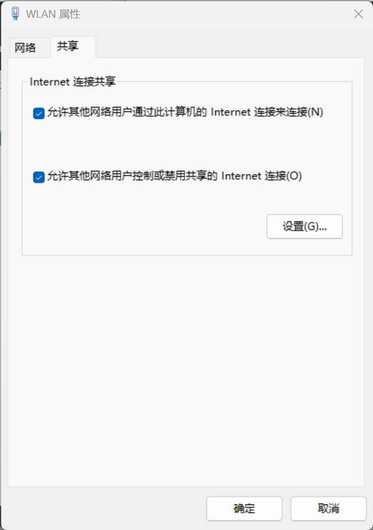

# RaspberryPi 5

约束：

- 具有WiFi或网线
- 使用RaspberryPi OS

## 烧写镜像

### Raspberry Pi Imager（推荐）

### Balena Etcher

Balena Etcher 是一个跨平台且，用户界面友好的镜像文件烧写工具。

1. 下载Balena Etcher

   选择合适的操作系统版本下载[balenaEtcher](https://etcher.balena.io/)

2. 下载RaspberryPi OS

   下载[RaspberryPi OS](https://mirrors.bfsu.edu.cn/raspberry-pi-os-images/raspios_arm64/images/raspios_arm64-2024-03-15/2024-03-15-raspios-bookworm-arm64.img.xz)到本地

3. 打开Balena Etcher烧写镜像

4. 将SD卡插入MicroSD 插槽内

   需要注意，SD卡的朝向

## 配置网络

### WiFi配置

配置网络路由表


### 有限网络-路由器

### 有线网络-共享(仅限win)

使用网线一端连接树莓派一段连接电脑

打开`网络连接`面板

选择已经连接好网络的适配器，配置为共享



### 配制ap热点

```text
interface=wlan0
driver=nl80211
ssid=rap
hw_mode=g
channel=7
wmm_enabled=0
macaddr_acl=0
auth_algs=1
ignore_broadcast_ssid=0
wpa=2
wpa_passphrase=87654321
wpa_key_mgmt=WPA-PSK
wpa_pairwise=TKIP
rsn_pairwise=CCMP
```

## 更换软件源

编辑 `/etc/apt/sources.list.d/raspi.list` 文件。

```
deb https://mirrors.bfsu.edu.cn/raspberrypi/ bookworm main
```

## 配置ssh连接

## 风扇调速

[Rockchip平台cpu散热风扇随温度自动调速的配置方法_pwm-fan-CSDN博客](https://blog.csdn.net/weixin_43245753/article/details/126227479)

## 安装docker

## 搭建第一个网站

## 搭建gitea

## 搭建私人网盘

## 内网穿透

基于腾讯云轻量服务器
