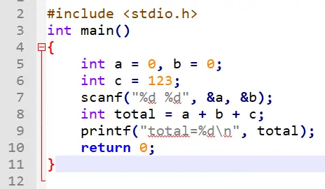
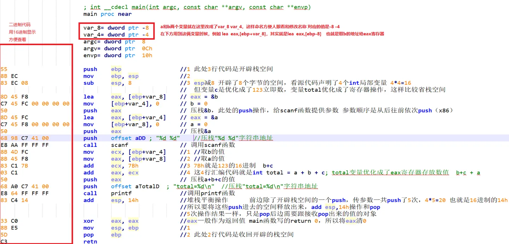

# 系统栈和数据结构中的栈

我觉得你这是把[数据结构](https://www.zhihu.com/search?q=数据结构&search_source=Entity&hybrid_search_source=Entity&hybrid_search_extra={"sourceType"%3A"answer"%2C"sourceId"%3A583993517})中的栈和内存中的栈混为一谈了

内存中的堆栈也是栈，但是这个堆栈是可以用[内存地址](https://www.zhihu.com/search?q=内存地址&search_source=Entity&hybrid_search_source=Entity&hybrid_search_extra={"sourceType"%3A"answer"%2C"sourceId"%3A583993517})去访问其中的数据的，并不是只能用push pop操作

当然，[堆栈](https://www.zhihu.com/search?q=堆栈&search_source=Entity&hybrid_search_source=Entity&hybrid_search_extra={"sourceType"%3A"answer"%2C"sourceId"%3A583993517})中压栈和出栈操作仍然是push、pop，但是这两个操作你可以想成插入、删除，一旦pop后这个数据就"消失"了

所以你的[printf](https://www.zhihu.com/search?q=printf&search_source=Entity&hybrid_search_source=Entity&hybrid_search_extra={"sourceType"%3A"answer"%2C"sourceId"%3A583993517})访问的b并不是pop方式取到的，而是通过地址拿到的

如果访问b使用pop方式取的话，那岂不是一个变量只能是一次性的使用了。。。

补上俩图 一个是VS2017写的源码  一个是编译好的exe使用IDA的[反汇编语句](https://www.zhihu.com/search?q=反汇编语句&search_source=Entity&hybrid_search_source=Entity&hybrid_search_extra={"sourceType"%3A"answer"%2C"sourceId"%3A583993517})

对照源码和反汇编  更好理解[局部变量](https://www.zhihu.com/search?q=局部变量&search_source=Entity&hybrid_search_source=Entity&hybrid_search_extra={"sourceType"%3A"answer"%2C"sourceId"%3A583993517})和栈的关系以及栈如何存储 如何释放

图是PC下截的，在PC看大图更舒服些

源码：

IDA反汇编扒出来的main函数

