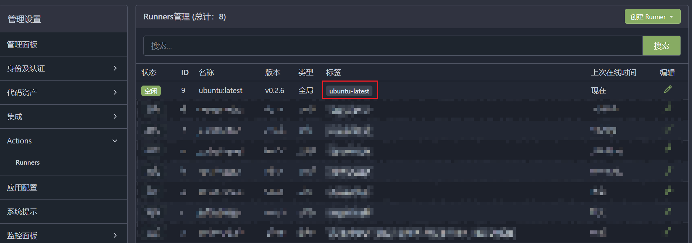

# `gitea`部署手册

## 约束

- 已经成功构建了一个`nginx`和`filebrowser`服务器
- `gitea`版本号：1.21.7
- 拥有一个代理服务器，用于迁移github上的仓库

## 创建git用户

```bash
adduser test
```

### 查看git用户id

```bash
# command
cat /etc/passwd

# result
...
git:x:1003:1003:,,,:/home/git:/bin/bash
```

需要记录`1003:1003`

注明：`用户id:用户组id`

## 实现SSH容器直通

在主机上创建 SSH 密钥对。该密钥对将用于向主机验证主机上的 `git` 用户。

```bash
# 非root用户
sudo -u git ssh-keygen -t rsa -b 4096 -C "Gitea Host Key"
# root用户
git ssh-keygen -t rsa -b 4096 -C "Gitea Host Key"
```

在主机上创建一个名为 `/usr/local/bin/gitea` 的文件（具有可执行权限）。添加一下内容

```bash
ssh -p 2222 -o StrictHostKeyChecking=no git@127.0.0.1 "SSH_ORIGINAL_COMMAND=\"$SSH_ORIGINAL_COMMAND\" $0 $@"
```

由于此端口不需要暴露给外界，因此可以将其映射到主机的 `localhost`：

```bash
ports:
  # [...]
  - "127.0.0.1:2222:22"
```

需要将创建的密钥的公共密钥加入到`~/git/.ssh/authorized_keys`这样才能够完成验证

```bash
echo "$(cat /home/git/.ssh/id_rsa.pub)" >> /home/git/.ssh/authorized_keys
```

!!! warning "注意"
    来自 git 用户的公钥需要“按原样”添加，而通过 Gitea 网络界面添加的所有其他公钥将以 command="/app [...] 作为前缀。

这是详细的说明，当发出 SSH 请求时会发生什么：

1. 使用 `git` 用户向主机发出 SSH 请求，例如 `git clone git@domain:user/repo.git`。
2. 在 `/home/git/.ssh/authorized_keys` 中，该命令执行 `/usr/local/bin/gitea` 脚本。
3. `/usr/local/bin/gitea` 将 SSH 请求转发到端口 2222，该端口已映射到容器的 SSH 端口（22）。
4. 由于 `/home/git/.ssh/authorized_keys` 中存在 `git` 用户的公钥，因此身份验证主机 → 容器成功，并且 SSH 请求转发到在 docker 容器中运行的 Gitea。

## 使用PostgreSQL 数据库创建gitea实例

```yaml
version: "3.8"

networks:
  gitea:
    external: false

volumes:
  gitea:
    driver: local
  postgres:
    driver: local

services:
  server:
    image: gitea/gitea:1.21.7
    container_name: gitea
    environment:
      - USER_UID=1003
      - USER_GID=1003
      - GITEA__database__DB_TYPE=postgres
      - GITEA__database__HOST=db:5432
      - GITEA__database__NAME=gitea
      - GITEA__database__USER=gitea
      - GITEA__database__PASSWD=gitea
    restart: always
    networks:
      - gitea
    volumes:
      - gitea:/data
      - /home/git/.ssh/:/data/git/.ssh
      - /etc/timezone:/etc/timezone:ro
      - /etc/localtime:/etc/localtime:ro
    ports:
      - "3000:3000"      
      - "127.0.0.1:2222:22"
    depends_on:
      - db
  db:
    image: postgres:14
    restart: always
    environment:
      - POSTGRES_USER=gitea
      - POSTGRES_PASSWORD=gitea
      - POSTGRES_DB=gitea
    networks:
      - gitea
    volumes:
      - postgres:/var/lib/postgresql/data

```

## nginx反向代理,配置域名配置`https`

`app.ini`文件配置

```ini
[server]
DOMAIN = gitea.*.ltd
SSH_DOMAIN = gitea.*.ltd
ROOT_URL = http://gitea.*.ltd
```

`nginx.conf`文件配置

```conf
server {
    listen 80;
    server_name gitea.*.ltd;

    location / {
        proxy_pass http://172.17.0.1:3000;
        proxy_set_header Host $host;
        proxy_set_header X-Real-IP $remote_addr;
        proxy_set_header X-Forwarded-For $proxy_add_x_forwarded_for;
        proxy_set_header X-Forwarded-Proto $scheme;
    }
}
```

## 配置代理

[Docker安装Squid代理服务 - 知乎 (zhihu.com)](https://zhuanlan.zhihu.com/p/680115911)

[gitea配置全局代理用于镜像github源-阿里云开发者社区 (aliyun.com)](https://developer.aliyun.com/article/944888)

修改`app.ini`文件

```ini
PROXY_ENABLED = true
PROXY_URL = https://1.14.*.*:3128
PROXY_HOSTS = *.github.com
```

## 服务配置

配置`app.ini`以满足一些个性需求

限制所有仓库只有登录后才能访问

```ini
REQUIRE_SIGNIN_VIEW = true
```

关闭gitea的注册功能

```ini
REQUIRE_SIGNIN_VIEW = true
```

## 配置`actions`

### 配置act_runner

#### 拉取镜像

```bash
docker pull gitea/act_runner:latest # for the latest stable release
```

#### 生成配置文件

```bash
docker run --entrypoint="" --rm -it gitea/act_runner:latest act_runner generate-config > config.yaml
```

#### 通过`docker-compose.yml`启动`act_runner`容器

```yaml
version: "3.8"
services:
  runner:
    image: gitea/act_runner:nightly
    environment:
      CONFIG_FILE: /config.yaml
      GITEA_INSTANCE_URL: "${INSTANCE_URL}"
      GITEA_RUNNER_REGISTRATION_TOKEN: "${REGISTRATION_TOKEN}"
      GITEA_RUNNER_NAME: "${RUNNER_NAME}"
      GITEA_RUNNER_LABELS: "${RUNNER_LABELS}"
    volumes:
      - ./config.yaml:/config.yaml
      - ./data:/data
      - /var/run/docker.sock:/var/run/docker.sock
```

- `INSTANCE_URL`为gitea实例的url/ip地址
- `REGISTRATION_TOKEN`为创建token(来自gitea实例)
- `RUNNER_NAME`为该`runner`名称(可自定义)
- `RUNNER_LABELS`为创建的镜像来源(不可自定义)

??? tip "小贴士"
    RUNNER_LABELS实例: ubuntu-latest:docker://node:16-bullseye

    ubuntu-latest为红框标注

    

    //node:16-bullseye为`actions`脚本启动的镜像来源

    [全部镜像来源](https://github.com/nektos/act/blob/master/IMAGES.md)

    可以指定多个使用`,`分割
