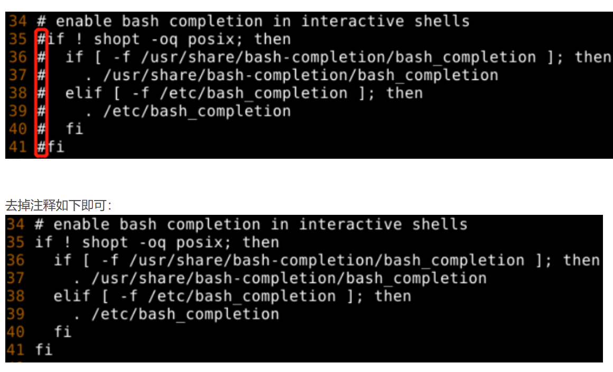

# Ubuntu 24.04（server）安装指南

## 安装

## 系统优化配置

### 更换软件镜像源

```bash
# 中科大镜像源
sudo sed -i 's@//.*archive.ubuntu.com@//mirrors.ustc.edu.cn@g' /etc/apt/sources.list.d/ubuntu.sources
```

> 使用 HTTPS 可以有效避免国内运营商的缓存劫持。可以运行以下命令替换：
> `sudo sed -i 's/http:/https:/g' /etc/apt/sources.list.d/ubuntu.sources`

### 配置终端命令补全


### 配置debian终端命令补全

#### 1. 安装bash-completion 包

```bash
apt install bash-completion
```

#### 2. 编辑/etc/bash.bashrc

安装bash-completion后还需要在 /etc/bash.bashrc 中编辑enable bash completion in interactive shells这一项配置，将其注释全部去掉

```bash
vim /etc/bash.bashrc
```



#### 3. 执行新配置文件

```bash
source /etc/bash.bashrc
```

## 安装基础软件

### 安装C环境

```bash
sudo apt install build-essential
```


### 安装docker

Docker 提供了一个自动配置与安装的脚本，支持 Debian、RHEL、SUSE 系列及衍生系统的安装。

以下内容假定

- 您为 root 用户，或有 sudo 权限，或知道 root 密码；
- 您系统上有 curl 或 wget

```shell
export DOWNLOAD_URL=https://mirrors.ustc.edu.cn/docker-ce
# 如您使用 curl
curl -fsSL https://get.docker.com/ | sh
# 如您使用 wget
wget -O- https://get.docker.com/ | sh
```

基础docker配置

1. 启动docker加入开机自启

    ```shell
    sudo systemctl enable docker
    sudo systemctl start docker
    ```

2. 将当前用户加入docker组

	通过将用户加入docker组的方式，可以不用加`sudo`运行`docker`命令

    ```shell
    # 添加docker用户组，一般已存在，不需要执行
    sudo groupadd docker
    # 将登陆用户加入到docker用户组中
    sudo gpasswd -a $USER docker
    # 更新用户组
    newgrp docker
    # 测试docker命令是否可以使用sudo正常使用
    docker version
    ```

    执行以下命令，打开 `/etc/docker/daemon.json` 配置文件。

3. 配置腾讯云 Docker 镜像源加速镜像下载

    ```bash
    vim /etc/docker/daemon.json
    ```

    ```json
    {
      "registry-mirrors": ["https://docker.1ms.run"]
    }
    ```

    ```bash
    # 重启docker服务以生效配置
    sudo systemctl restart docker
    ```

4. 添加用户组

    ```sh
    # 添加docker用户组，一般已存在，不需要执行
    sudo groupadd docker
    
    # 将登陆用户加入到docker用户组中
    sudo gpasswd -a $USER docker
    
    # 更新用户组
    newgrp docker
    ```
