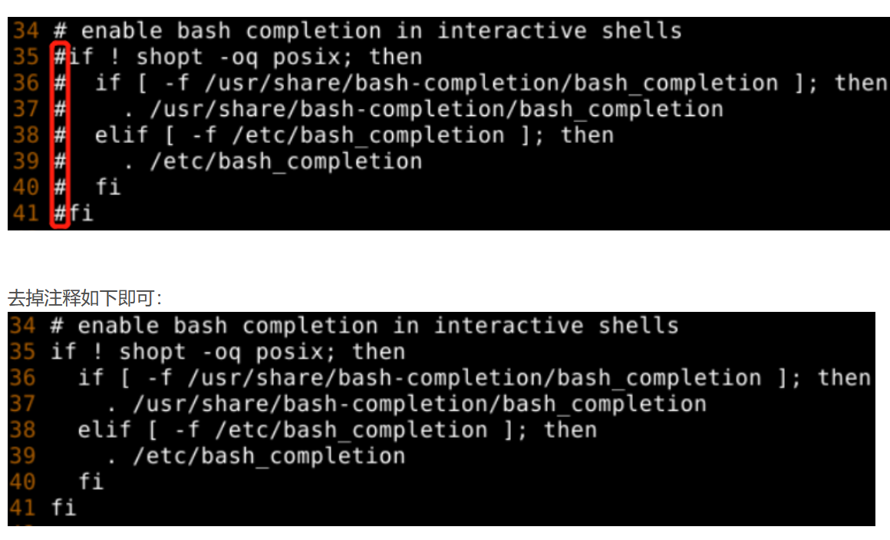

# wsl安装配置指南-基于debin

## 安装Debian

```shell
 # 配置wsl子系统，并下载debian系统
wsl --install -d Debain
```

### 开启systemD支持

配置`wsl.conf`开启systemD支持

```shell
[boot]
systemd=true
```

### 配置代理

配置`.wslconfig`文件

> [!note]
>
> 文件在windows用户目录中

```toml
# Settings apply across all Linux distros running on WSL 2
[wsl2]
# Limits VM memory to use no more than 4 GB, this can be set as whole numbers using GB or MB
memory=4GB
# 要向 WSL 2 VM 添加的交换空间量，0 表示无交换文件。
swap=8GB
# 强制 WSL 使用 Windows 的 HTTP 代理信息
autoProxy=true
# 如果值为 mirrored，则会启用镜像网络模式。 默认或无法识别的字符串会生成 NAT 网络
networkingMode=mirrored
# 更改将 DNS 请求从 WSL 代理到 Windows 的方式
dnsTunneling=true
# 如果设置为 true，则 Windows 防火墙规则以及特定于 Hyper-V 流量的规则可以筛选 WSL 网络流量。
firewall=true
```

配置完后，宿主机中打开代理后，可以镜像到`wsl`(值得注意的是，)

### 配置debian终端命令补全

#### 1. 安装bash-completion 包

```bash
apt install bash-completion
```

#### 2. 编辑/etc/bash.bashrc

安装bash-completion后还需要在 /etc/bash.bashrc 中编辑enable bash completion in interactive shells这一项配置，将其注释全部去掉

```bash
vim /etc/bash.bashrc
```



#### 3. 执行新配置文件

```bash
source /etc/bash.bashrc
```

### 解决终端命令补全卡顿

#### 1. 修改`/etc/wsl.conf`文件

```toml
[interop]
appendWindowsPath=false
```

#### 2. 添加软链接

为了可以使用`code`命令直接打开`vscode`

```shell
# 需要替换为vscode的安装路径
ln -s /mnt/c/Users/paopaozhi/AppData/Local/Programs/Microsoft\ VS\ Code/bin/code /bin/code
```

## 基本软件安装

### 安装C环境

```bash
apt install build-essential
```

### 安装docker

#### 自动安装方式

Docker 提供了一个自动配置与安装的脚本，支持 Debian、RHEL、SUSE 系列及衍生系统的安装。

以下内容假定

- 您为 root 用户，或有 sudo 权限，或知道 root 密码；
- 您系统上有 curl 或 wget

```shell
export DOWNLOAD_URL="https://mirrors.bfsu.edu.cn/docker-ce"
# 如您使用 curl
curl -fsSL https://get.docker.com/ | sh
# 如您使用 wget
wget -O- https://get.docker.com/ | sh
```

#### 启动docker加入开机自启

```shell
sudo systemctl enable docker
sudo systemctl start docker
```

#### 将当前用户加入docker组

通过将用户加入docker组的方式，可以不用加`sudo`运行`docker`命令

```shell
# 添加docker用户组，一般已存在，不需要执行
sudo groupadd docker
# 将登陆用户加入到docker用户组中
sudo gpasswd -a $USER docker
# 更新用户组
newgrp docker
# 测试docker命令是否可以使用sudo正常使用
docker version
```

执行以下命令，打开 `/etc/docker/daemon.json` 配置文件。

#### 配置腾讯云 Docker 镜像源加速镜像下载

```bash
vim /etc/docker/daemon.json
```

1.2 按 **i** 切换至编辑模式，添加以下内容，并保存。

```bash
{
   "registry-mirrors": [
   "https://mirror.ccs.tencentyun.com"
  ]
}
```

1.3 执行以下命令，重启 Docker 即可。示例命令以 CentOS 7 为例。

```bash
sudo systemctl restart docker
```

1.4. 重启 Docker 后，并运行以下命令来查看当前 Docker 的配置。如镜像源配置成功，则输出的内容中会包含下图所示的部分。

**说明：**

您也可以直接执行`docker pull <镜像名>` 命令来拉取镜像，如能成功拉取，则也能够说明配置成功。

## 管理系统

### apt包管理器

#### 安装包

```shell
apt install <packName>
```

#### 卸载包

```shell
apt remove <packName>
```

#### 清理无用的依赖包

```shell
# 删除为了满足依赖而安装的，但现在不再需要的软件包（包括已安装包），保留配置文件；
# 高能警告：慎用本命令！！！
# 它会在你不知情的情况下，一股脑删除很多“它认为”你不再使用的软件；
apt-get autoclean
# 删除为了满足某些依赖安装的，但现在不再需要的软件包；
# apt的底层包是dpkg, 而dpkg安装软件包时, 会将*.deb文件放在/var/cache/apt/archives/中；
# 因此本命令会删除该目录下已经过期的deb；
apt-get autoremove
```

## 参考文献

1. [适用于 Linux 的 Windows 子系统文档 | Microsoft Learn](https://learn.microsoft.com/zh-cn/windows/wsl/)

2. [docker-ce | 镜像站使用帮助 | 北京外国语大学开源软件镜像站 | BFSU Open Source Mirror](https://mirrors.bfsu.edu.cn/help/docker-ce/)
3. [Docker Docs](https://docs.docker.com/)

