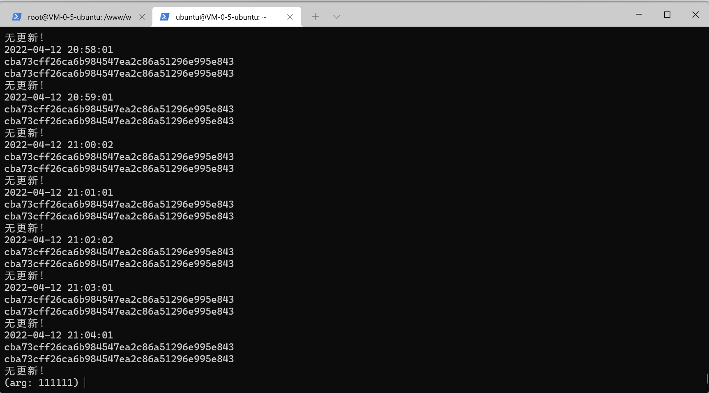

# 基于crontab，使用python执行自动git实现博客的自动更新

1.准备python文件

```python
from calendar import c
import http
from subprocess import getoutput
import requests
import time

print(time.strftime('%Y-%m-%d %H:%M:%S',time.localtime(time.time())))

debug = getoutput("cd /www/wwwroot/wiki.paopaozhiiot.cn")
debug = getoutput("ls -l")

commit_local = getoutput("git log")
commit_local = commit_local.split()
commit_local = commit_local[1]
print(commit_local)


url = "https://gitee.com/api/v5/repos/paopaozhi/paopaozhi/branches/main?"

data = {
    "access_token":"c0082ee42eb4ef916bd44a1d0179ef81"
}

r = requests.get(url=url,params=data)
r = r.json()
commit_far = r["commit"]["sha"]
print(commit_far)

if commit_far == commit_local:
    print("无更新！")
else:
    ii = getoutput("git pull gitee")
    print(ii)
```

2.启动cron服务

3.使用crontab -e 编辑定时任务

在文件尾部添加

```sh
* * * * * <解释器路径> <脚本文件路径> >>  <重定向日志路径>
```

- 第一次使用会让你选择使用的编辑器

4.重启cron service

```sh
sudo service cron restart  
```

5.通过查看日志了解程序运行情况

```sh
vim <重定向日志路径>
```


