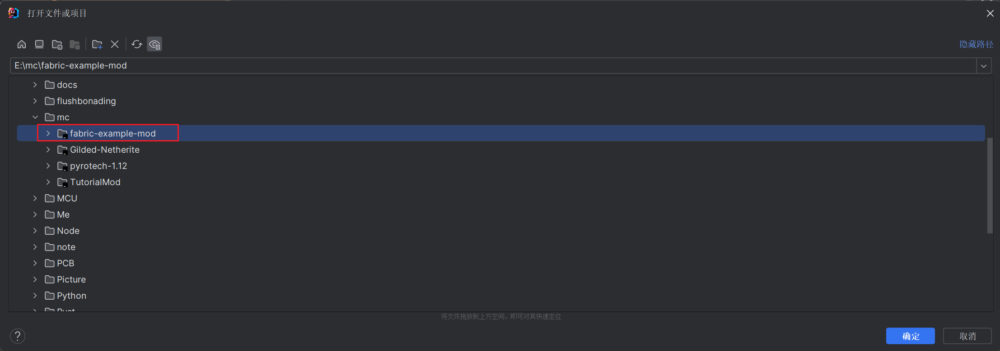
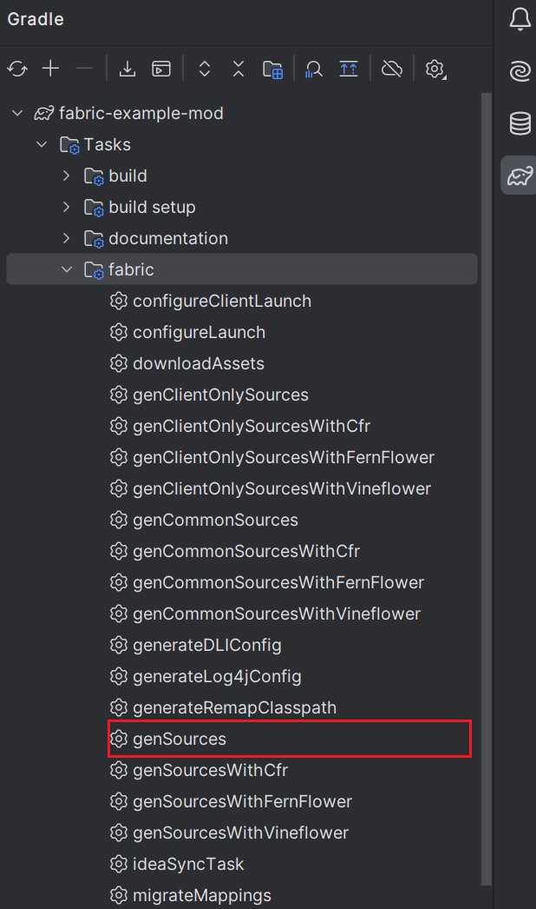
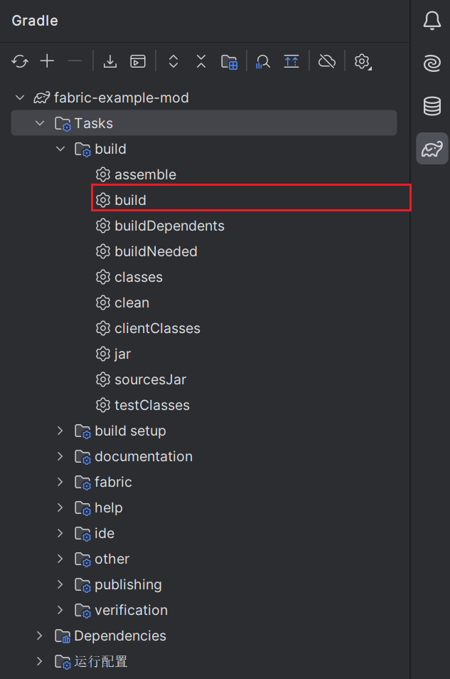

# 开发环境搭建

## 下载模板工程

[模板工程](https://fabricmc.net/develop/template/)

配置参数

## IDEA导入工程



导入工程后，会自动开始构建

> 使用镜像构建加速：
>
> ```gradle title='build.gradle'
> repositories {
> 	maven {
> 		url 'https://maven.aliyun.com/nexus/content/groups/public'
> 	}
> 	maven {
> 		url 'https://repository.hanbings.io/proxy'
> 	}
> }
> ```
>
> ``` title=‘settings.gradle’
> pluginManagement {
> 	repositories {
> 		maven {
> 			name = 'Fabric'
> 			url = 'https://repository.hanbings.io/proxy'
> 		}
> 		mavenCentral()
> 		gradlePluginPortal()
> 	}
> }

## 生成minecraft源代码

双击运行`gradle`任务



## Build mod jar包

双击运行`gradle`任务

