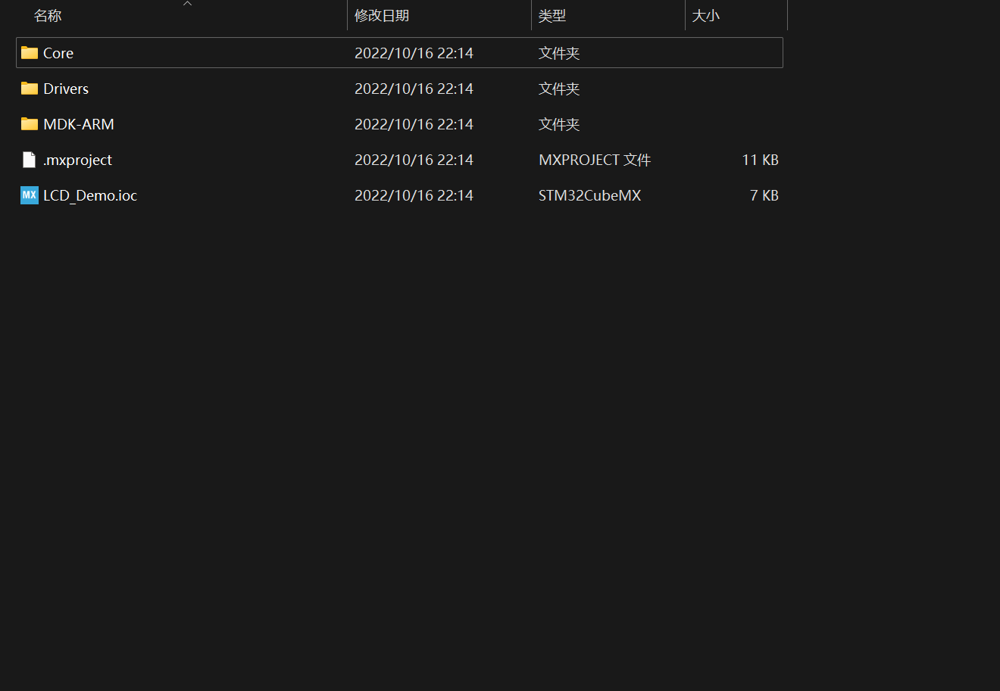
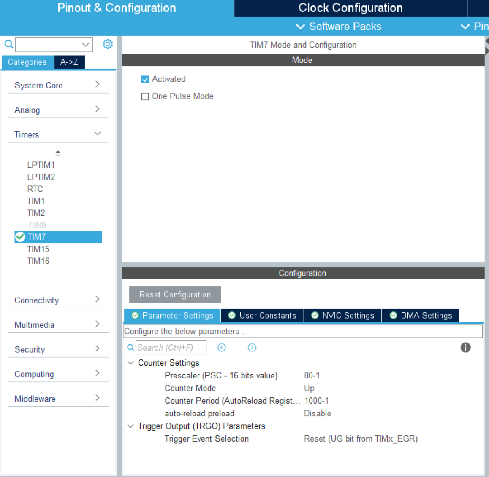
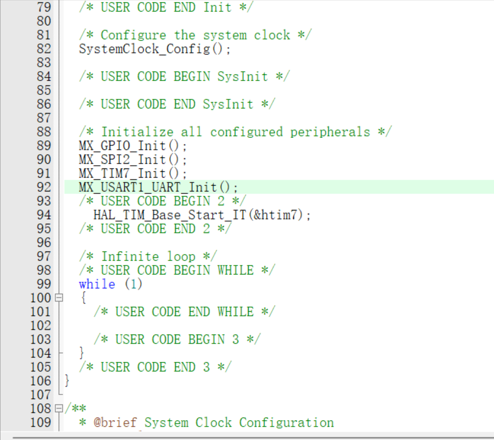
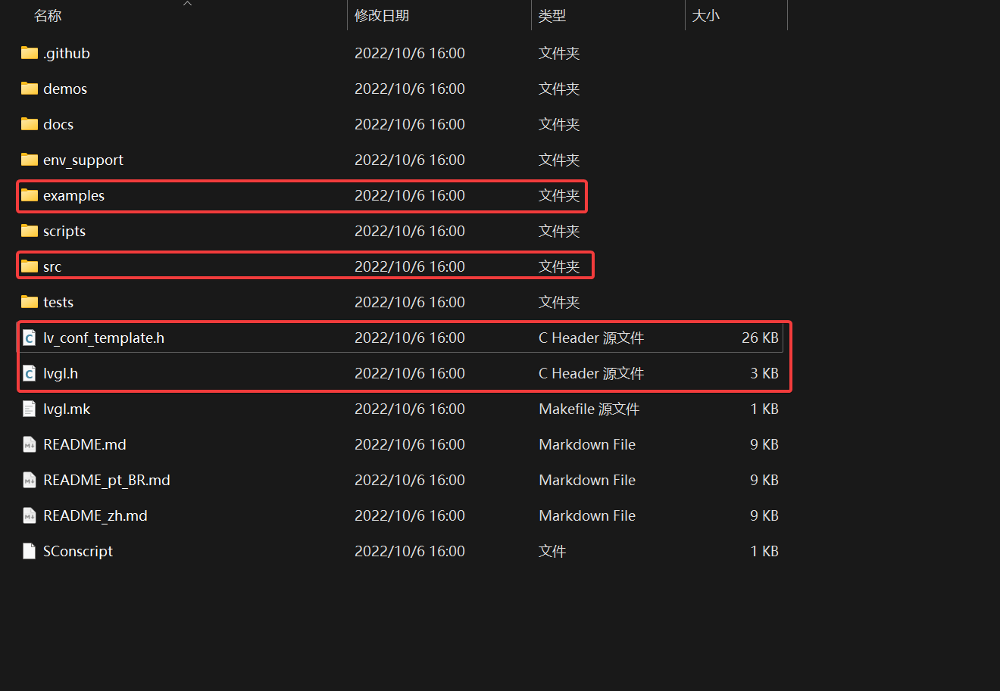
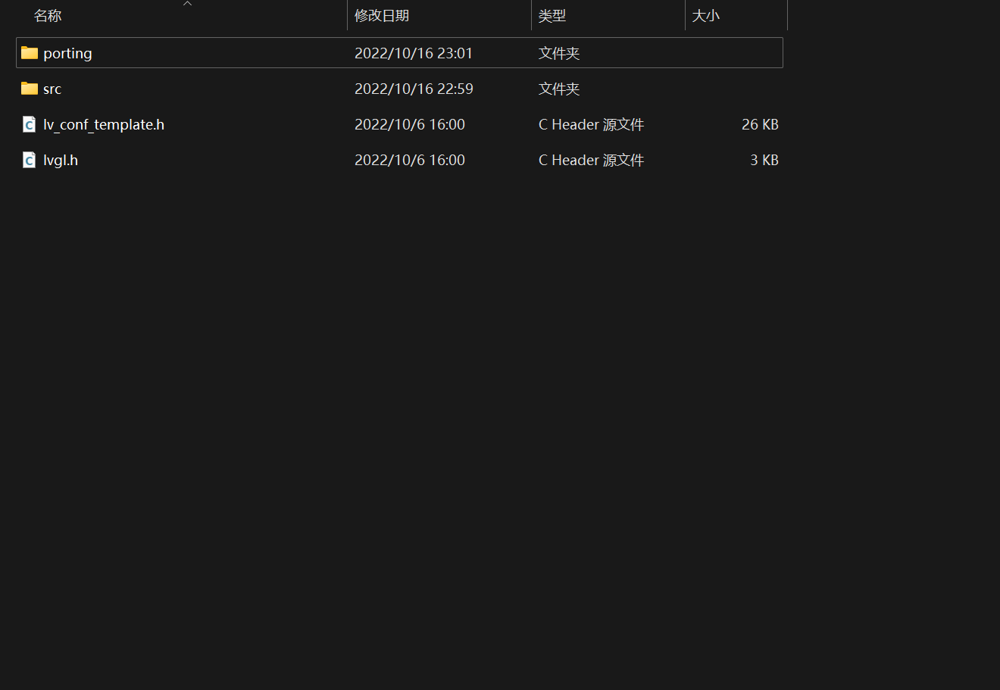
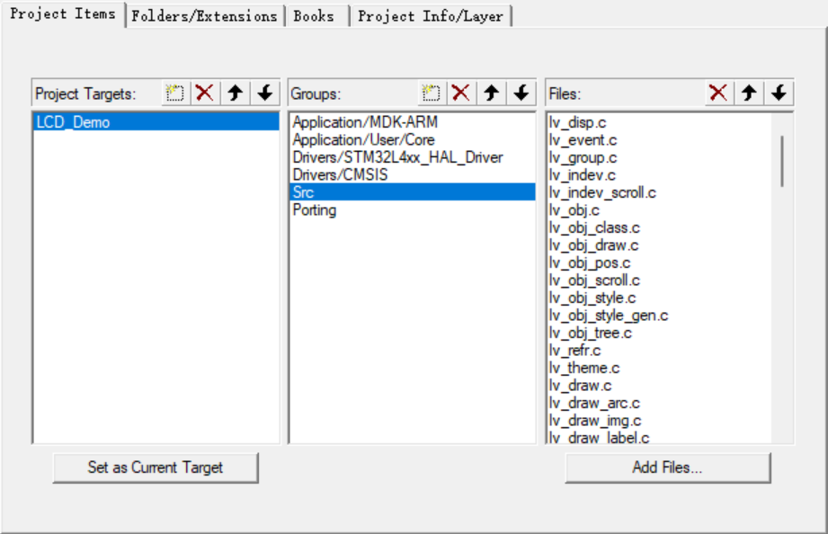
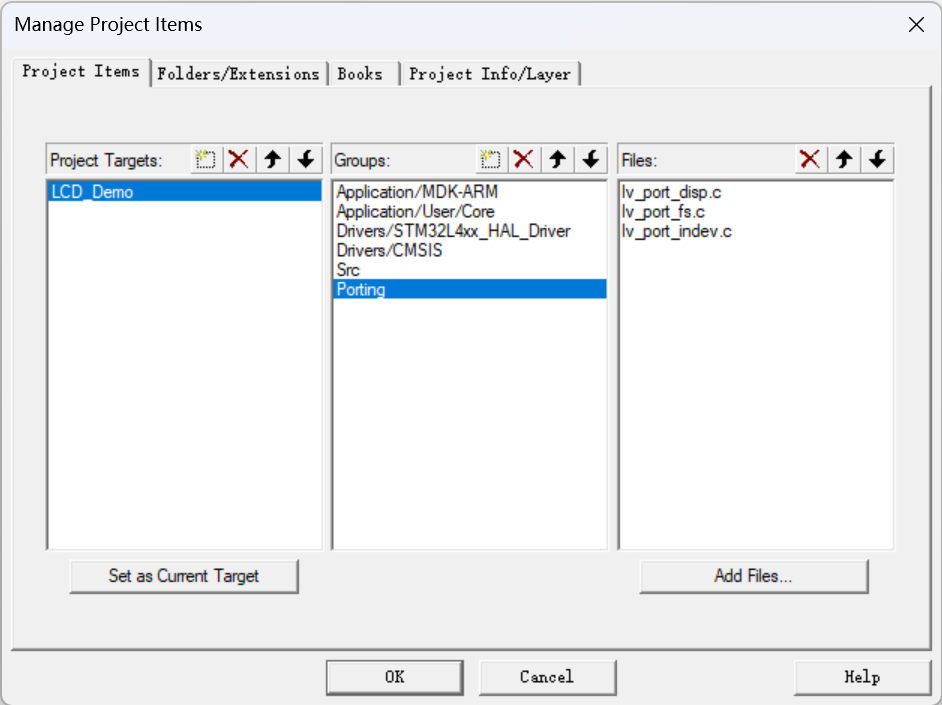

# LVGL - 移植STM32

| 名称     |                         |
| -------- | ----------------------- |
| 硬件平台 | BearPi-IoT(STM32L431RC) |
| 软件平台 | Keil5/STM32Cubx         |

# LVGL概述


LVGL(轻巧而多功能的图形库)是一个免费的开放源代码图形库，它提供创建具有易于使用的图形元素，精美的视觉效果和低内存占用的嵌入式GUI所需的一切。

# 移植开始

## 获取LVGL源码

GitHub项目地址：[https://github.com/lvgl/lvgl](https://github.com/lvgl/lvgl)

LVGLV8.3：[Release Release v8.3.3 · lvgl/lvgl (github.com)](https://github.com/lvgl/lvgl/releases/tag/v8.3.3)

本教程使用releaseV8.3，建议读者使用和本教程相同的版本避免不必要的问题。

## 使用STM32Cubx创建Keil工程

由于教程使用BearPi-IoT开发板，该开发板官方已经写了一个很棒的教程所以这里不再赘述，只给出教程的链接：[使用硬件SPI驱动TFT-LCD](https://mp.weixin.qq.com/s/Sb12hE7dqG8shA77ADcCnA)

创建好的工程文件夹如下：



虽然我们通过BearPi-IoT官方教程已经完成了LCD的简单驱动，但是，为了可以使用LVGL我们至少实现一个画点函数，这里直接给出代码，将其放到**lcd_spi2_drv.c**

```c
/**
 * @brief	写半个字的数据到LCD
 *
 * @param   cmd		需要发送的数据
 *
 * @return  void
 */
void LCD_Write_HalfWord(const uint16_t da) {
    uint8_t data[2] = {0};

    data[0] = da >> 8;
    data[1] = da;

    LCD_RS(1);
    SPI_WriteByte(data, 2);
}

/**
 * 画点带颜色函数
 *
 * @param   x,y		画点坐标
 *
 * @return  void
 */
void LCD_Draw_ColorPoint(uint16_t x, uint16_t y, uint16_t color) {
    LCD_Address_Set(x, y, x, y);
    LCD_Write_HalfWord(color);
}
```

并且为了驱动LVGL我们初始化一个定时器，开启中断，时钟频率为1ms



**注意：请务必在主函数中开启定时器的中断**



## 添加lvgl文件

将LVGL源码文件复制到工程中。**建议新建一个文件夹独立存放**



注意：**porting**文件夹来自**examples**



修改头文件名称将**_template**去掉，该步骤不影响后续移植，笔者只是为了美观方便。

## 将 lvgl C文件加入keil工程中

- 将lvgl/src目录下的**core draw font hal misc widgets**文件夹下的所有文件全部添加进lvgl组

- 将lvgl/src/extra/目录下的文件添加进lvgl组。具体为：
    **layouts目录下所有子目录文件**
    **themes目录下所有子目录文件**
    **widgets目录下所有子目录文件**
    **lv_extra.c**



将**porting**文件夹的所有C文件加入keil工程中




