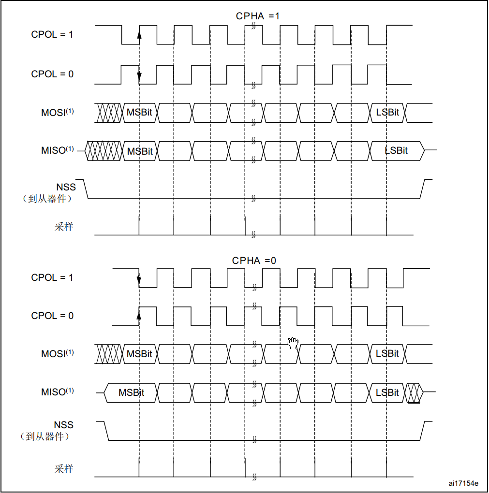

## SPI简介

## SPI硬件结构

| 名称 | 用途         |
| ---- | ------------ |
| CLK  | 时钟线       |
| MOSI | 主设备传输线 |
| MISO | 主设备接受线 |

## SPI时钟参数

| 名称 | 用途     |
| ---- | -------- |
| CPOL | 时钟极性 |
| CPHA | 时钟相位 |

## SPI时序图

