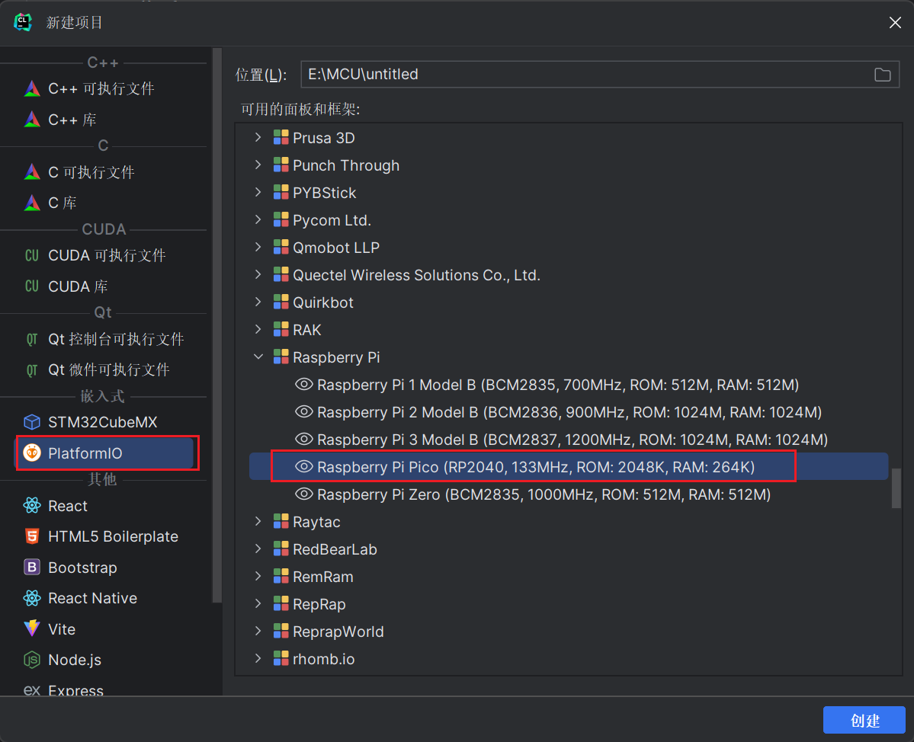
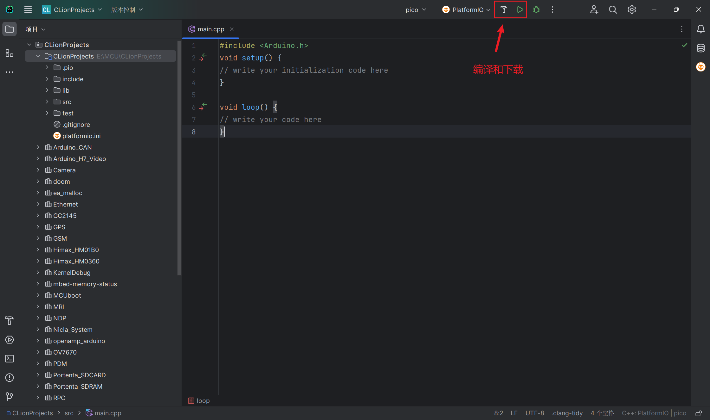

# clion 配置platformio环境

## 安装

环境：conda环境

1. 创建新的虚拟环境

   ```bash
   conda create -n flushbonad python=3.10
   ```

2. 安装platformio

   ```python
   pip install platformio
   ```

3. 添加环境变量

​	

4. 安装 `platformio for clion`

​	

## 测试

新建项目



> 自行选择对应的开发板，这里选择树莓派 pico

clion会自行构建，等待构建成功

