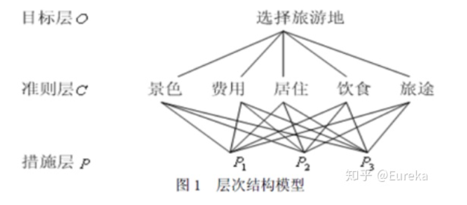
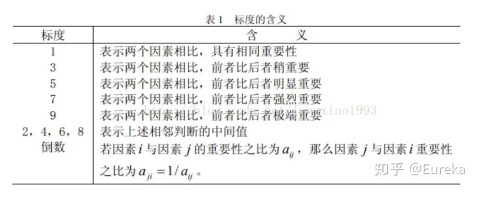

# 评价类模型

## 层次分析法

### 1.  概述

层次分析法（AHP）是将要决策的问题及其有关因素分解成目标、准则、方案等层次，进而进行定性和定量分析的决策方法。它的特征是合理地将定性与定量决策结合起来，按照思维、心理的规律把决策过程细致化（层次化、数量化）。

### 2. 建模步骤

1. 建立递阶层次结构模型；
2. 构造出各层次中的所有判断矩阵；
3. 层次单排序及一致性检验；
4. 层次总排序及一致性检验。

#### 2.1. 层次建立

#### 2.2. 构建判断矩阵

$$
A = (\begin{bmatrix}a_{11} & ... & a_{1n}\\\vdots & \ddots & \vdots \\a_{n1} & ... & a_{nn}\end{bmatrix}) = (a_{ij})_{m \times n}
$$

定义：

定义1： 若矩阵 $A = (a_{ij})_{m \times n}$ 满足

1. $a_{ij} > 0$
2. $a_{ij} = \frac{1}{a_{ij}}(i,j = 1,2,...,n)  $

称之为正反矩阵。

- 标度

  

#### 2.3. 层次单排序及一致性检验

一致性矩阵：满足关系式 $a_{ij}a_{jk} = a_{ik},\forall i,j,k = 1,2, \cdots n$ 的正反矩阵称为一致性矩阵。

1. 计算**一致性指标$CI$**
   $$
   CI = \frac{\lambda_{max} -n}{n - 1}  
   $$

2. 查找对应的随机一致性指标$RI$

   | n    |  1   |  2   |  3   |  4   |  5   |  6   |  7   |  8   |  9   |  10  |  11  |  12  |  13  |  14  |  15  |
   | ---- | :--: | :--: | :--: | :--: | :--: | :--: | :--: | :--: | :--: | :--: | :--: | :--: | :--: | :--: | :--: |
   | $RI$ |  0   |  0   | 0.52 | 0.89 | 1.12 | 1.26 | 1.36 | 1.41 | 1.46 | 1.49 | 1.52 | 1.54 | 1.56 | 1.58 | 1.59 |

3. 计算**一致性比例$CR$**
   $$
   CR = \frac{CI}{RI}
   $$
   如果$CR<0.1$,则可以认为判断举证的一致性可以接受；否则需要对判断矩阵镜像修正。

#### 2.4. 判断矩阵计算权重

1. 算术平均法求权重
2. 几何平均法求权重
3. 特征值法求权重

### 3.  参考文献

[1.1 层次分析法模型部分_哔哩哔哩_bilibili](https://www.bilibili.com/video/BV1DW411s7wi?p=1&vd_source=5eb3559f14ff1452cac51806869d20fd)

[数学建模十大算法之——层次分析法 - 知乎 (zhihu.com)](https://zhuanlan.zhihu.com/p/43631314)

