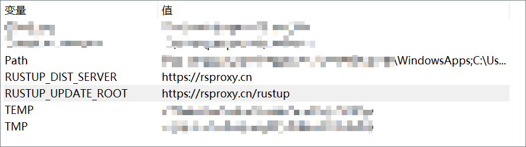

# Rust windos安装

## 添加环境变量

```PowerShell
RUSTUP_DIST_SERVER="https://rsproxy.cn"
RUSTUP_UPDATE_ROOT="https://rsproxy.cn/rustup"
```



## 运行rustup-init.exe

------

## 配置[crates.io](http://crates.io) 镜像

~/.cargo/config:

```PowerShell
[source.crates-io]
replace-with = 'rsproxy-sparse'
[source.rsproxy]
registry = "https://rsproxy.cn/crates.io-index"
[source.rsproxy-sparse]
registry = "sparse+https://rsproxy.cn/index/"
[registries.rsproxy]
index = "https://rsproxy.cn/crates.io-index"
[net]
git-fetch-with-cli = true
```