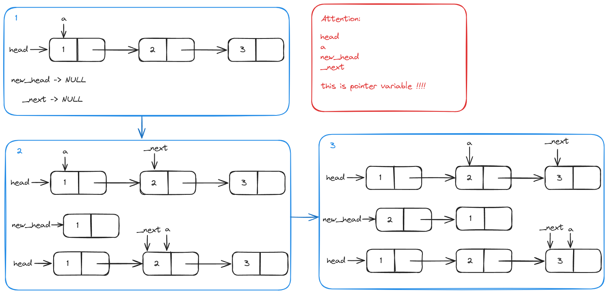
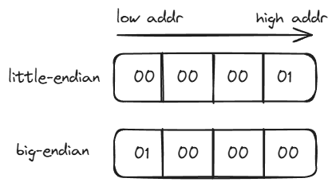

# 华清远见 实习面试题

## 描述有哪些段

- `Code`：代码段，存放程序代码
- `RO-data`：只读数据段，存放程序中定义的常量
- `RW-data`：读写数据段，存放初始化为非0的全局变量
- `ZI-data`：数据段，存放未初始化的全局变量及初始化为0的变量

## `int const *p`, `int *const p`, `int *const *p`的区别

`int const *p` 表示`*p`的值不能改变，而`p`是可以改变的，即地址变量可以指向新的地址，但是指向的变量的值是不可以改变的。

`int *const p` 表示`*p`的值可以改变，而`p`是不可改变的，即地址变量不可以指向新的地址，但是指向的变量的值是可以改变的。

`int *const *p` 表示`*p`的值不能改变，而`p`也是不可以改变的，即地址变量不可以指向新的地址，并且指向的变量的值也是不可以改变的。

## 简述UART和SPI的区别

UART

- 全双工通讯
- 异步通讯

SPI

- 全双工通讯
- 串行同步通讯

## 实现strcmp()函数，不能调用其他的库函数

```c
int strcmp(const char *s1, const char *s2)
{
    while (*s1 == *s2)
    {
        if (*s1 == '\0')
        {
            return 0;
        }
        s1++;
        s2++;
    }
    if (*s1 > *s2)
    {
        return 1;
    }
    else
    {
        return -1;
    }
}
```

## 将链表逆序输出，不可以使用其他的

题目前提条件：

```c
typedef struct _node {
    struct _node *next;
    int vaule;
}Node;

Node head;
```

使用双指针法逆序单向链表：



```c
// 默认这个单向链表是一个不带头节点的单向链表
int reversed_list(Node *head)
{
    Node *_next;
    Node *a = head;
    Node *new_head = NULL;

    while (a != NULL)
    {
        _next = a->next;
        a->next = new_head;
        new_head = a;
        a = _next;
    }
    head = new_head;
    return 0;
}
```

## 编写程序区分机器是大端还是小端



1. 声明一个`int`变量，赋值为`1`，再将其第一个`byte`取出来，判断是为`1`

    ```c
    bool IsBig_Endian(void)
    {
        unsigned int test = 1;
        if( *((unsigned char *)&test) == 1)
        {
            return true;
        }else
        {
            return false;
        }
    }
    ```

2. 使用联合体判断

    ```c
    bool IsBig_Endian(void)
    {
        union {
            unsigned int i;
            unsigned char s[4];
        }c;
        c.i = 1;
        return (c.s[0] == 1);
    }
    ```
